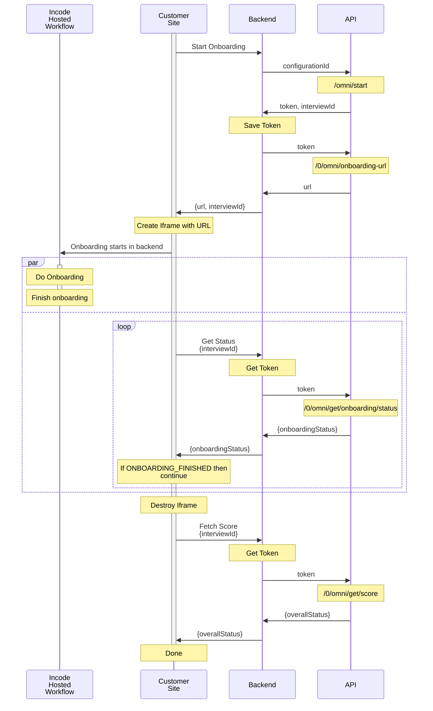

# Sample Iframe App
This app showcase how to create a low code app that will fetch the
url of the onboarding, load it in an iframe and wait for it to finish
before fetching the score.



# Fake Backend Server
Starting the session, getting the status and fetching the scores must be
done in the backend, to simplify development this sample includes a
fake_backend.js file that does this in the frontend.

Please be advised to replace this with a proper backend for your
production runs.

The APIKEY should never be exposed in the frontend.

# Install
First install all the required packages
```bash
npm install
```

# Configure
Copy `.env.example` as `.env` and configure it with the values of your flow

```
# HERE ONLY FOR DEMO PURPOSES, THE APIKEY AND THE FLOW_ID SHOULD NEVER BE IN THE FRONTEND.
VITE_FAKE_BACKEND_APIURL=https://demo-api.incodesmile.com
VITE_FAKE_BACKEND_APIKEY=
VITE_FAKE_BACKEND_FLOWID=
```

# Development
This repo is configured so run it in development by executing
```bash
npm run dev
```

You will get a hot reloading environment that exposes the page in
localhost and in the ip of the machine in case you want to try it
in your cellphone.

## Session Storage

This sample application uses localStorage to store session data (token and interviewId). In a production environment, you should:

1. Store tokens securely on your backend
2. Implement proper session management
3. Handle token expiration and renewal
4. Consider security implications of storing sensitive data

The implementation in this demo is for demonstration purposes only.

# Author

© Incode Technologies Inc. All rights reserved.